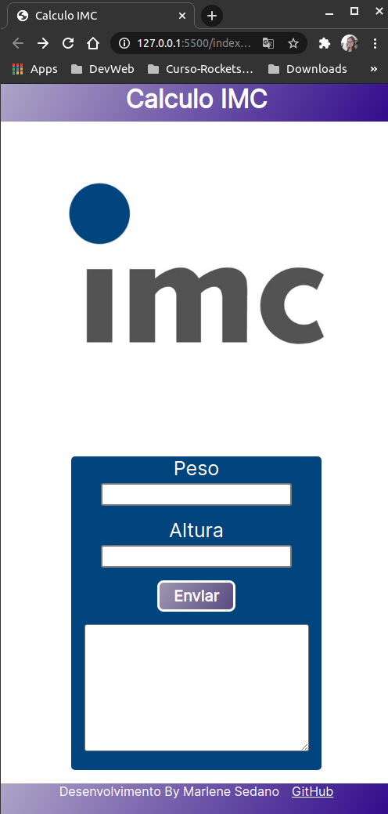
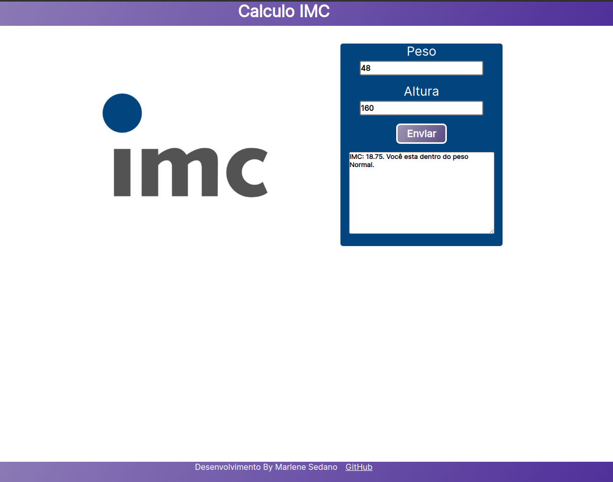

# Calculo IMC - JavaScript Puro (Responsivo)

Este projeto foi desenvolvido para aprendizado.

## Projeto Calculo IMC

Calculo Simples de IMC, o projetinho foi feito para
aprimorar conhecimento de HTML, CSS e JavaScript.

## :rocket: Tecnologias

Este projeto foi desenvolvido com as seguintes tecnologias:

- HTML
- Css
- JavaScript

                                                     
## Demonstração
 


Após preencher os campos e clicar no button Enviar, o 
sistema irá mostrar uma pré-visualização dos campos no textarea.



## Como usar

```
# Clone este repositório
$ git clone https://github.com/marlenesedano/calculadora_imc_web.git


